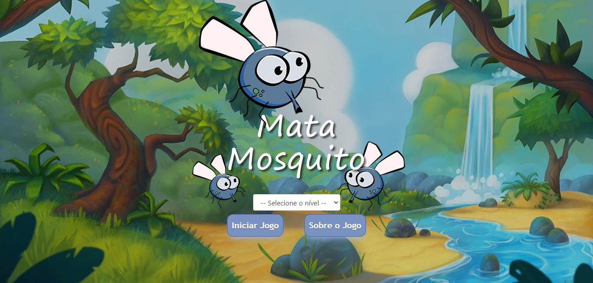

<h1 align="center">Mata mosquito</h1>
<h1 align="center"></h1>

<hr>

### 📚 Sobre

O jogo Mata mosquito, é um jogo desenvolvido durante o Curso de Desenvolvimento Web Completo da Udemy.
Feito para a prática do conteúdo JavaScript.

### 🎨 Detalhe

Realizei diversas implementações e alterações no aplicativo.

<hr>

### 🔥 Como contribuir

```
Fork este respositório
Faça as mudanças
Abra um pull request
```

### 💻 Tecnologias utilizadas

Nesta Calculadora Javascript foram utilizadas as seguintes tecnologias

- [HTML](https://www.w3schools.com/html/)
- [CSS](https://www.w3schools.com/css/)
- [JavaScript](https://www.w3schools.com/js/)
- [Bootstrap](https://getbootstrap.com/)

### ✈️ Como acessar o Jogo

Hospedado no Netlify

https://mata-mosquito-gsj.netlify.app/

Ou então 

```
Faça o download do repositório e execute index.html
```
